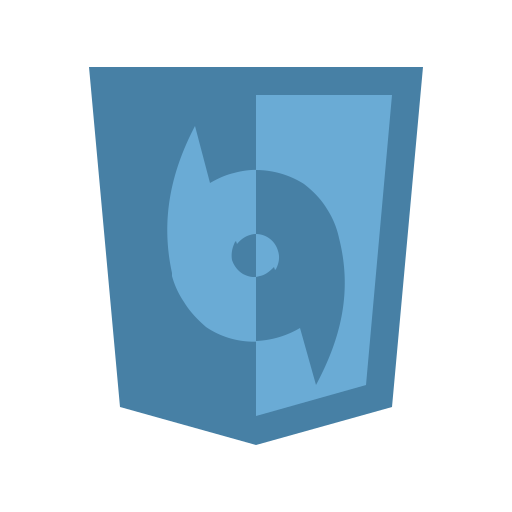

<p align="center">
  
</p>

<h1 align="center">bQuery.js</h1>

<p align="center">

[](https://github.com/bQuery/bQuery)
[](https://github.com/bQuery/bQuery/stargazers)
[](https://github.com/bQuery/bQuery/issues)
[](https://github.com/bQuery/bQuery/blob/main/LICENSE.md)
[](https://www.npmjs.com/package/@bquery/bquery)
[](https://bundlephobia.com/package/@bquery/bquery)
[](https://unpkg.com/@bquery/bquery)
[](https://www.codefactor.io/repository/github/bquery/bquery)
[](https://www.jsdelivr.com/package/npm/@bquery/bquery)

</p>

**The jQuery for the modern Web Platform.**

bQuery.js is a slim, TypeScript-first library that combines jQuery's direct DOM workflow with modern features like reactivity, async data composables, Web Components, motion utilities, routing, stores, and declarative views — without a mandatory build step.

## Highlights

- **Zero-build capable**: runs directly in the browser; build tools are optional.
- **Async data built-in**: fetch and async state composables integrate directly with signals.
- **Security-focused**: DOM writes are sanitized by default; Trusted Types supported.
- **Modular**: the core stays small; extra modules are opt-in.
- **TypeScript-first**: clear types and strong IDE support.
- **Tree-shakeable**: import only what you need.
- **Storybook-ready**: default components can be previewed and developed in Storybook with dedicated story template helpers.

## Installation

### Via npm/bun/pnpm

```bash
# npm
npm install @bquery/bquery

# bun
bun add @bquery/bquery

# pnpm
pnpm add @bquery/bquery
```

### Via CDN (Zero-build)

#### ES Modules (recommended)

```html
<script type="module">
  import { $, signal } from 'https://unpkg.com/@bquery/bquery@1/dist/full.es.mjs';

  const count = signal(0);
  $('#counter').text(`Count: ${count.value}`);
</script>
```

#### UMD (global variable)

```html
<script src="https://unpkg.com/@bquery/bquery@1/dist/full.umd.js"></script>
<script>
  const { $, signal } = bQuery;
  const count = signal(0);
</script>
```

#### IIFE (self-executing)

```html
<script src="https://unpkg.com/@bquery/bquery@1/dist/full.iife.js"></script>
<script>
  const { $, $$ } = bQuery;
  $$('.items').addClass('loaded');
</script>
```

## Import Strategies

```ts
// Full bundle (all modules)
import {
  $,
  signal,
  component,
  registerDefaultComponents,
  defineBqueryConfig,
} from '@bquery/bquery';

// Core only
import { $, $$ } from '@bquery/bquery/core';

// Core utilities (named exports, tree-shakeable)
import { debounce, merge, uid, once, utils } from '@bquery/bquery/core';

// Reactive only
import {
  signal,
  computed,
  effect,
  linkedSignal,
  persistedSignal,
  useAsyncData,
  useFetch,
  createUseFetch,
} from '@bquery/bquery/reactive';

// Components only
import {
  bool,
  component,
  defineComponent,
  html,
  registerDefaultComponents,
} from '@bquery/bquery/component';

// Motion only
import { transition, spring, animate, timeline } from '@bquery/bquery/motion';

// Security only
import { sanitize, sanitizeHtml, trusted } from '@bquery/bquery/security';

// Platform only
import { storage, cache, useCookie, definePageMeta, useAnnouncer } from '@bquery/bquery/platform';

// Router, Store, View
import { createRouter, navigate } from '@bquery/bquery/router';
import { createStore, defineStore } from '@bquery/bquery/store';
import { mount, createTemplate } from '@bquery/bquery/view';

// Storybook helpers
import { storyHtml, when } from '@bquery/bquery/storybook';
```

## Modules at a glance

| Module        | Description                                        | Size (gzip) |
| ------------- | -------------------------------------------------- | ----------- |
| **Core**      | Selectors, DOM manipulation, events, utilities     | ~11.3 KB    |
| **Reactive**  | `signal`, `computed`, `effect`, async data/fetch   | ~0.3 KB     |
| **Component** | Lightweight Web Components with props + defaults   | ~1.9 KB     |
| **Motion**    | View transitions, FLIP, timelines, scroll, springs | ~4.0 KB     |
| **Security**  | HTML sanitizing, Trusted Types, CSP                | ~0.7 KB     |
| **Platform**  | Storage, cache, cookies, meta, announcers, config  | ~2.2 KB     |
| **Router**    | SPA routing, navigation guards, history API        | ~2.2 KB     |
| **Store**     | Signal-based state management, persistence         | ~0.3 KB     |
| **View**      | Declarative DOM bindings, directives               | ~4.3 KB     |

Storybook authoring helpers are also available as a dedicated entry point via `@bquery/bquery/storybook`.

## Quick examples

### Core – DOM & events

```ts
import { $, $$ } from '@bquery/bquery/core';

$('#save').on('click', (event) => {
  console.log('Saved', event.type);
});

$('#list').delegate('click', '.item', (event, target) => {
  console.log('Item clicked', target.textContent);
});

$('#box').addClass('active').css({ opacity: '0.8' }).attr('data-state', 'ready');

const color = $('#box').css('color');

if ($('#el').is('.active')) {
  console.log('Element is active');
}

$$('.container').find('.item').addClass('found');
```

### Reactive – signals

```ts
import {
  signal,
  computed,
  effect,
  batch,
  watch,
  readonly,
  linkedSignal,
} from '@bquery/bquery/reactive';

const count = signal(0);
const doubled = computed(() => count.value * 2);

effect(() => {
  console.log('Count changed', count.value);
});

watch(count, (newVal, oldVal) => {
  console.log(`Changed from ${oldVal} to ${newVal}`);
});

const readOnlyCount = readonly(count);

batch(() => {
  count.value++;
  count.value++;
});

count.dispose();

const first = signal('Ada');
const last = signal('Lovelace');
const fullName = linkedSignal(
  () => `${first.value} ${last.value}`,
  (next) => {
    const [nextFirst, nextLast] = next.split(' ');
    first.value = nextFirst ?? '';
    last.value = nextLast ?? '';
  }
);

fullName.value = 'Grace Hopper';
```

### Reactive – async data & fetch

```ts
import { signal, useFetch, createUseFetch } from '@bquery/bquery/reactive';

const userId = signal(1);

const user = useFetch<{ id: number; name: string }>(() => `/users/${userId.value}`, {
  baseUrl: 'https://api.example.com',
  watch: [userId],
  query: { include: 'profile' },
});

const useApiFetch = createUseFetch({
  baseUrl: 'https://api.example.com',
  headers: { 'x-client': 'bquery-readme' },
});

const settings = useApiFetch<{ theme: string }>('/settings');

console.log(user.pending.value, user.data.value, settings.error.value);
```

### Components – Web Components

```ts
import {
  bool,
  component,
  defineComponent,
  html,
  registerDefaultComponents,
  safeHtml,
} from '@bquery/bquery/component';
import { sanitizeHtml, trusted } from '@bquery/bquery/security';

const badge = trusted(sanitizeHtml('<span class="badge">Active</span>'));

component('user-card', {
  props: {
    username: { type: String, required: true },
    age: { type: Number, validator: (v) => v >= 0 && v <= 150 },
  },
  state: { count: 0 },
  beforeMount() {
    console.log('About to mount');
  },
  connected() {
    console.log('Mounted');
  },
  beforeUpdate(newProps, oldProps) {
    return newProps.username !== oldProps.username;
  },
  updated(change) {
    console.log('Updated because of', change?.name ?? 'state/signal change');
  },
  onError(error) {
    console.error('Component error:', error);
  },
  render({ props, state }) {
    return safeHtml`
      <button class="user-card" ${bool('disabled', state.count > 3)}>
        ${badge}
        <span>Hello ${props.username}</span>
      </button>
    `;
  },
});

const UserCard = defineComponent('user-card-manual', {
  props: { username: { type: String, required: true } },
  render: ({ props }) => html`<div>Hello ${props.username}</div>`,
});

customElements.define('user-card-manual', UserCard);

const tags = registerDefaultComponents({ prefix: 'ui' });
console.log(tags.button); // ui-button
```

### Storybook – authoring helpers

```ts
import { storyHtml, when } from '@bquery/bquery/storybook';

export const Primary = {
  args: { disabled: false, label: 'Save' },
  render: ({ disabled, label }) =>
    storyHtml`
      <ui-card>
        <ui-button ?disabled=${disabled}>${label}</ui-button>
        ${when(!disabled, '<small>Ready to submit</small>')}
      </ui-card>
    `,
};
```

### Motion – animations

```ts
import { animate, keyframePresets, spring, transition } from '@bquery/bquery/motion';

await transition({
  update: () => {
    $('#content').text('Updated');
  },
  classes: ['page-transition'],
  types: ['navigation'],
  skipOnReducedMotion: true,
});

await animate(card, {
  keyframes: keyframePresets.pop(),
  options: { duration: 240, easing: 'ease-out' },
});

const x = spring(0, { stiffness: 120, damping: 14 });
x.onChange((value) => {
  element.style.transform = `translateX(${value}px)`;
});
await x.to(100);
```

### Security – sanitizing

```ts
import { sanitize, escapeHtml, sanitizeHtml, trusted } from '@bquery/bquery/security';
import { safeHtml } from '@bquery/bquery/component';

const safeMarkup = sanitize(userInput);
const safe = sanitize('<form id="cookie">...</form>');
const urlSafe = sanitize('<a href="java\u200Bscript:alert(1)">click</a>');
const secureLink = sanitize('<a href="https://external.com" target="_blank">Link</a>');
const safeSrcset = sanitize('');
const safeForm = sanitize('<form action="javascript:alert(1)">...</form>');
const escaped = escapeHtml('<script>alert(1)</script>');
const icon = trusted(sanitizeHtml('<span class="icon">♥</span>'));
const button = safeHtml`<button>${icon}<span>Save</span></button>`;
```

### Platform – config, cookies & accessibility

```ts
import {
  defineBqueryConfig,
  useCookie,
  definePageMeta,
  useAnnouncer,
  storage,
  notifications,
} from '@bquery/bquery/platform';

defineBqueryConfig({
  fetch: { baseUrl: 'https://api.example.com' },
  transitions: { skipOnReducedMotion: true, classes: ['page-transition'] },
  components: { prefix: 'ui' },
});

const theme = useCookie<'light' | 'dark'>('theme', { defaultValue: 'light' });
const cleanupMeta = definePageMeta({ title: 'Dashboard' });
const announcer = useAnnouncer();

theme.value = 'dark';
announcer.announce('Preferences saved');
cleanupMeta();

const local = storage.local();
await local.set('theme', theme.value);

const permission = await notifications.requestPermission();
if (permission === 'granted') {
  notifications.send('Build complete', {
    body: 'Your docs are ready.',
  });
}
```

### Router – SPA navigation

```ts
import { effect } from '@bquery/bquery/reactive';
import { createRouter, navigate, currentRoute } from '@bquery/bquery/router';

const router = createRouter({
  routes: [
    { path: '/', name: 'home', component: HomePage },
    { path: '/user/:id', name: 'user', component: UserPage },
    { path: '*', component: NotFound },
  ],
});

router.beforeEach(async (to) => {
  if (to.path === '/admin' && !isAuthenticated()) {
    await navigate('/login');
    return false;
  }
});

effect(() => {
  console.log('Current path:', currentRoute.value.path);
});
```

### Store – state management

```ts
import {
  createStore,
  createPersistedStore,
  defineStore,
  mapGetters,
  watchStore,
} from '@bquery/bquery/store';

const counterStore = createStore({
  id: 'counter',
  state: () => ({ count: 0, name: 'Counter' }),
  getters: {
    doubled: (state) => state.count * 2,
  },
  actions: {
    increment() {
      this.count++;
    },
  },
});

const settingsStore = createPersistedStore({
  id: 'settings',
  state: () => ({ theme: 'dark', language: 'en' }),
});

const useCounter = defineStore('counter', {
  state: () => ({ count: 0 }),
  getters: {
    doubled: (state) => state.count * 2,
  },
  actions: {
    increment() {
      this.count++;
    },
  },
});

const counter = useCounter();
const getters = mapGetters(counter, ['doubled']);

watchStore(
  counter,
  (state) => state.count,
  (value) => {
    console.log('Count changed:', value, getters.doubled);
  }
);
```

### View – declarative bindings

```ts
import { mount, createTemplate } from '@bquery/bquery/view';
import { signal } from '@bquery/bquery/reactive';

const count = signal(0);
const items = signal(['Apple', 'Banana', 'Cherry']);

mount('#app', {
  count,
  items,
  increment: () => count.value++,
});
```

## Browser Support

| Browser | Version | Support |
| ------- | ------- | ------- |
| Chrome  | 90+     | ✅ Full |
| Firefox | 90+     | ✅ Full |
| Safari  | 15+     | ✅ Full |
| Edge    | 90+     | ✅ Full |

> **No IE support** by design.

## Documentation

- **Getting Started**: [docs/guide/getting-started.md](docs/guide/getting-started.md)
- **Core API**: [docs/guide/api-core.md](docs/guide/api-core.md)
- **Agents**: [docs/guide/agents.md](docs/guide/agents.md)
- **Components**: [docs/guide/components.md](docs/guide/components.md)
- **Reactivity**: [docs/guide/reactive.md](docs/guide/reactive.md)
- **Motion**: [docs/guide/motion.md](docs/guide/motion.md)
- **Security**: [docs/guide/security.md](docs/guide/security.md)
- **Platform**: [docs/guide/platform.md](docs/guide/platform.md)
- **Router**: [docs/guide/router.md](docs/guide/router.md)
- **Store**: [docs/guide/store.md](docs/guide/store.md)
- **View**: [docs/guide/view.md](docs/guide/view.md)

## Local Development

```bash
# Install dependencies
bun install

# Start VitePress docs
bun run dev

# Run Storybook
bun run storybook

# Run tests
bun test

# Build library
bun run build

# Build docs
bun run build:docs

# Generate API documentation
bun run docs:api
```

## Project Structure

```text
bQuery.js
├── src/
│   ├── core/       # Selectors, DOM ops, events, utils
│   ├── reactive/   # Signals, computed, effects, async data
│   ├── component/  # Web Components helper + default library
│   ├── motion/     # View transitions, FLIP, springs
│   ├── security/   # Sanitizer, CSP, Trusted Types
│   ├── platform/   # Storage, cache, cookies, meta, config
│   ├── router/     # SPA routing, navigation guards
│   ├── store/      # State management, persistence
│   └── view/       # Declarative DOM bindings
├── docs/           # VitePress documentation
├── .storybook/     # Storybook config
├── stories/        # Component stories
├── tests/          # bun:test suites
└── dist/           # Built files (ESM, UMD, IIFE)
```

## Contributing

See [CONTRIBUTING.md](CONTRIBUTING.md) for guidelines.

## AI Agent Support

This project provides dedicated context files for AI coding agents:

- **[AGENT.md](AGENT.md)** — Architecture, module API reference, coding conventions, common tasks
- **[llms.txt](llms.txt)** — Compact LLM-optimized project summary
- **[.github/copilot-instructions.md](.github/copilot-instructions.md)** — GitHub Copilot context

## License

MIT – See [LICENSE.md](LICENSE.md) for details.
